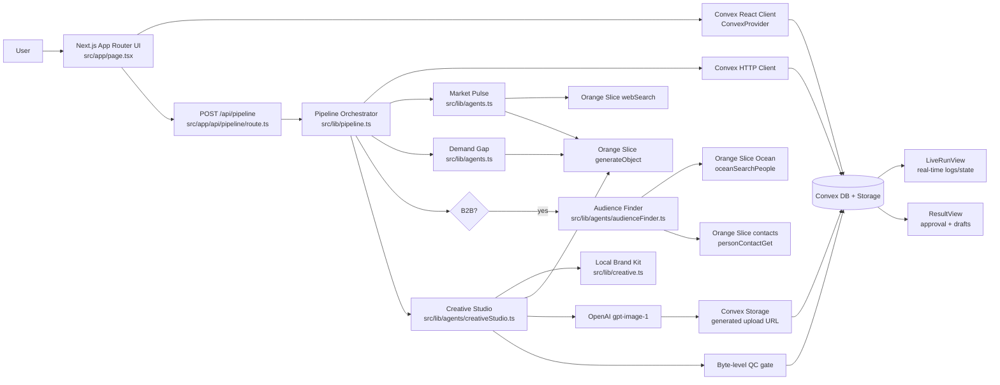

# Forge

Forge turns a product description into a sourced GTM campaign. It runs a small agent pipeline over live market signals, locks one demand angle, generates a branded social creative, and stages the resulting post for human approval. In B2B mode it also builds a prospect audience and drafts personalized LinkedIn outreach.

The system is intentionally human-in-the-loop: it never auto-publishes posts and never auto-sends cold outreach.

## What It Does

- Collects product, audience, differentiator, platform, price tier, and B2B/B2C mode.
- Uses Orange Slice for structured reasoning, market search, and B2B Ocean people search.
- Uses OpenAI `gpt-image-1` for ad image generation when `OPENAI_API_KEY` is present.
- Stores all campaign state, activity logs, signals, demand angles, audiences, prospects, creatives, outreach drafts, and staged posts in Convex.
- Streams live progress to the UI through Convex queries.
- Falls back to clearly labeled sample mode when an optional provider key is missing.
- Marks the campaign `failed` when a configured provider call fails in a way that would otherwise require fabricated data.

## Architecture



## Request Flow

1. The client creates a Convex `campaigns` row through `api.campaigns.create`.
2. The client calls `POST /api/pipeline` with the new `campaignId`.
3. The route runs the pipeline synchronously with a raised `maxDuration` of 300 seconds.
4. `runPipeline` updates Convex status and activity logs as each phase starts or completes.
5. Market Pulse searches Reddit, X/Twitter, and LinkedIn through Orange Slice `webSearch`, then uses structured AI output to extract sourced `why_buy`, `why_not`, `buying_intent`, and `creative_gap` signals.
6. Demand Gap reads saved signals from Convex and locks one campaign angle.
7. B2B campaigns pause after Orange Slice Ocean audience estimation and wait for user approval before enrichment.
8. Creative Studio builds a deterministic local brand kit, writes copy through Orange Slice, generates an image through OpenAI when available, verifies the returned bytes, and stores accepted assets in Convex.
9. The result view lets the user approve staged broadcasts and, for B2B, approve outreach drafts. Approval creates staged/published records in `posts`; it does not publish to social networks.

## Pipeline States

B2C:

```text
queued -> researching -> angle_ready -> creative_ready -> ready_to_post -> posted
```

B2B:

```text
queued -> researching -> angle_ready -> building_audience -> audience_ready -> creative_ready -> ready_to_post -> posted
```

Any lane can enter:

```text
failed
```

The schema also includes `finding_audience` for compatibility with UI state handling.

## Data Model

Convex schema lives in `convex/schema.ts`.

| Table | Purpose |
| --- | --- |
| `campaigns` | Primary campaign record, input fields, mode, status, sample flags, QC override, error message. |
| `brandKits` | Deterministic brand context used by Creative Studio. |
| `signals` | Sourced market findings by type: `why_buy`, `why_not`, `buying_intent`, `creative_gap`. |
| `demand` | Locked demand gap, angle headline, reason, and target emotion. |
| `audiences` | B2B Ocean audience reference, list size, credit estimate, state, confirmation metadata. |
| `prospects` | Enriched B2B prospects with role, company, LinkedIn URL, contact fields, source, and intent signal. |
| `outreach` | Per-prospect LinkedIn draft messages and approval state. |
| `creatives` | Caption, CTA, hashtags, image prompt, image storage reference, QC status, platform, format, brand kit ID. |
| `posts` | Draft/approved/published staging records for Instagram and LinkedIn. |
| `activityLogs` | Agent timeline displayed in the live run UI. |

## External Services

### Orange Slice

Used for the core AI and B2B data path:

- `generateObject` for structured Market Pulse, Demand Gap, Creative Studio, and outreach output.
- `webSearch` for market signal search across Reddit, X/Twitter, and LinkedIn-result pages.
- `oceanSearchPeople` for B2B audience preview and prospect export.
- `personContactGet` for best-effort contact enrichment.

The adapter is `src/lib/orangeslice/client.ts`. If `ORANGESLICE_API_KEY` is absent or looks like a placeholder, the affected agent uses labeled sample output. If the key is present and a real call fails completely, the error propagates and the campaign is marked `failed`.

### OpenAI

Used only by `src/lib/creative.ts` for `gpt-image-1` image generation. If `OPENAI_API_KEY` is missing or generation fails, Creative Studio records a `needs_human` QC status instead of inventing an image.

### Fiber SDK

The repository still contains a Fiber SDK adapter in `src/lib/fiber`. The active pipeline path currently routes market search and B2B audience work through Orange Slice. Some UI labels still mention Fiber because the original hackathon flow used it for audience estimation; treat those labels as copy debt, not as the current source of truth.

## Repository Map

```text
src/app/
  page.tsx                  Client-side app shell and view state.
  api/pipeline/route.ts     Synchronous pipeline trigger endpoint.
  layout.tsx                Convex provider wiring and metadata.

src/components/
  IntakeView.tsx            Product intake and qualifiers.
  LiveRunView.tsx           Real-time agent status, logs, and Convex state table.
  ResultView.tsx            Creative preview, QC override, post approval, outreach approval.
  ConvexClientProvider.tsx  Convex React provider.

src/lib/
  pipeline.ts               Orchestrates all agent phases and Convex writes.
  agents.ts                 Market Pulse, Demand Gap, personalized outreach.
  agents/audienceFinder.ts  B2B audience preview and enrichment.
  agents/creativeStudio.ts  Copy, image generation, and QC result packaging.
  creative.ts               Brand kit, OpenAI image generation, byte-level QC.
  orangeslice/client.ts     Orange Slice SDK adapter.
  fiber/                    Legacy/inactive Fiber SDK adapter and types.
  convex.ts                 Browser Convex client.
  types.ts                  Shared frontend intake/view types.

convex/
  schema.ts                 Database schema.
  campaigns.ts              Public queries/mutations used by UI and pipeline.
  lib/logs.ts               Activity log helper.
```

## Quick Start

Install dependencies:

```bash
npm install
```

Start Convex and Next.js together:

```bash
npm run dev:all
```

Or start them separately:

```bash
npx convex dev
npm run dev
```

Open `http://localhost:3000`.

## Environment

Create `.env.local` from `.env.example` and fill the keys you want to exercise:

```bash
ORANGESLICE_API_KEY=
OPENAI_API_KEY=
FIBER_API_KEY=
NEXT_PUBLIC_CONVEX_URL=
CONVEX_DEPLOYMENT=
```

`npx convex dev` writes the Convex values. Provider keys are optional for local demo mode, but sample mode is deliberately labeled in the UI and persisted on the campaign.

Additional optional knobs:

```bash
OS_MAX_PROSPECTS=8
OS_ENRICH_CONTACTS=true
FIBER_MAX_PROSPECTS=8
```

## Development Commands

```bash
npm run dev       # Next.js dev server
npm run dev:all   # Convex dev plus Next.js dev server
npm run build     # Production build
npm run start     # Serve production build
npm run lint      # ESLint
```

## Operational Notes

- The pipeline route is synchronous. Long provider calls hold the request open, and the route has `maxDuration = 300`.
- Convex is the source of truth for UI progress. The UI does not infer completed work from local state once a campaign exists.
- `activityLogs` are append-only operational breadcrumbs for the live run.
- Creative approval is gated by QC. A missing or tiny image asset yields `needs_human` or `fail`; the user can explicitly override QC.
- B2B enrichment requires user confirmation after the audience estimate unless sample mode is active.
- The `approvePost` mutation stages a post and assigns a synthetic `staged-*` external ID. There is no social publishing integration.
- Outreach approval changes draft state only. The user must copy and send messages manually.

## Compliance Guarantees

- No automatic posting to Instagram or LinkedIn.
- No automatic cold DM or email send.
- No fabricated source URLs in real-provider mode.
- Sample data is labeled with sample flags and `sample://` source URLs.
- Provider failure with a configured key surfaces as `failed` instead of silently replacing real data with sample data.

## Known Gaps

- Some UI copy still says Fiber for B2B audience work even though the implemented pipeline uses Orange Slice Ocean.
- The Fiber adapter is retained but inactive in the current orchestrator.
- There is no background job queue; the pipeline executes inside the Next.js route.
- Authentication and per-user ownership checks are not implemented.
- There is no real social publishing adapter; posts are staged only.
